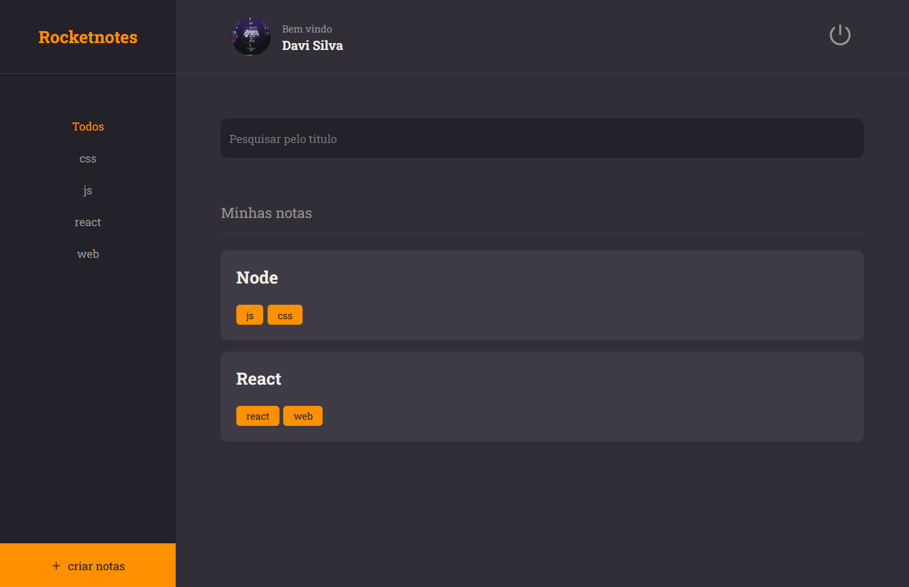

# Rocket Notes 

+ Trinha Explorer

> Uma área de ‘login’ conectada com banco de dados, junto a uma parte de criação de usuário.

> Tela inicial da aplicação onde o usuário pode cria notas, mudar nome e senha a sim como aplica uma foto para o avatar. Uma pesquisa interativa com as notas já criadas, utilizando nome ou tegs.

[Clique aqui para acessar ==> https://rocketnoteslive.netlify.app]
🔎

Projeto construido na trinha Explorer da Rocketseat.

## 🤖 Principais tecnologias

- REACT.JS
- Tailwind CSS
- NODE
- SQLite
- Knex

## 🗄 Banco de dados

- Beekeeper

## 👾Contato

paulohrufino600@gmail.com